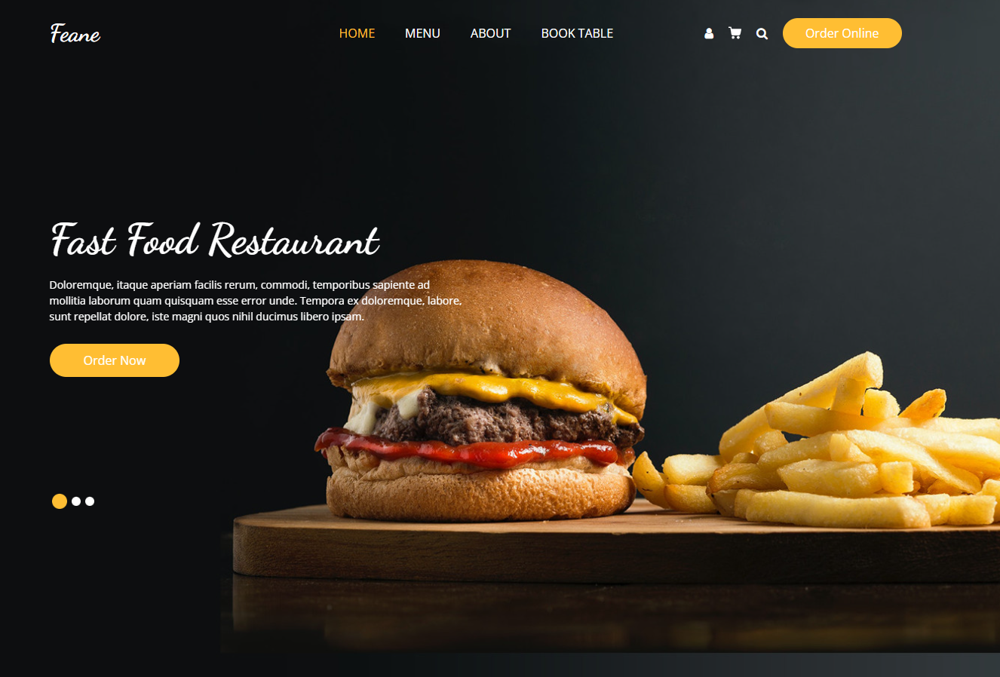
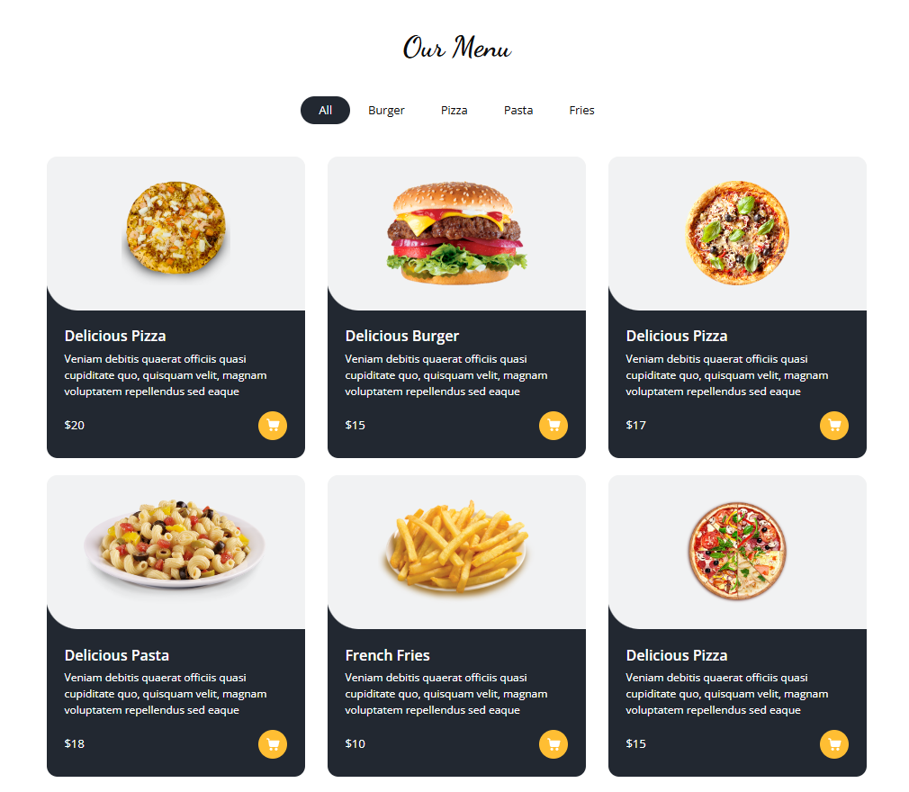

# RestaurantApp

RestaurantApp is a backend application designed to manage restaurant operations such as order management, customer handling, and menu management. Built using ASP.NET Core, this app utilizes a RESTful API architecture for efficient client-server communication and database operations.

## Screenshots:

## Features

- **Order Management**: Real-time updates for customer orders.
- **Menu Management**: Create, update, and manage restaurant menu items.
- **Scalable Architecture**: Modular services for future growth.

## Technologies Used

- **ASP.NET Core**: Framework for building the API and backend logic.
- **Entity Framework Core**: ORM for database interactions.
- **SQL Server**: Relational database for storing restaurant data.
- **RESTful API**: Standard communication protocol.

## Project Structure

| Folder                  | Description                                                 |
|-------------------------|-------------------------------------------------------------|
| **RestaurantApp.API**    | Web API for managing restaurant operations                  |
| **RestaurantApp.Data**   | Data models and DbContext for interacting with the database |
| **RestaurantApp.Services**| Business logic layer for restaurant operations             |
| **RestaurantApp.Common** | Shared utilities and helper functions                      |
| **RestaurantApp.sln**    | Main solution file that ties all projects together          |

## Future Features

- Multi-language support: Add internationalization (i18n) for different languages.
- User Authentication: Implement user roles (Admin, Staff, Customer) with JWT-based authentication.
- Analytics Dashboard: A dashboard for restaurant owners to monitor sales and customer data.
- Mobile App Integration: Develop APIs for a mobile application to interact with the backend.
